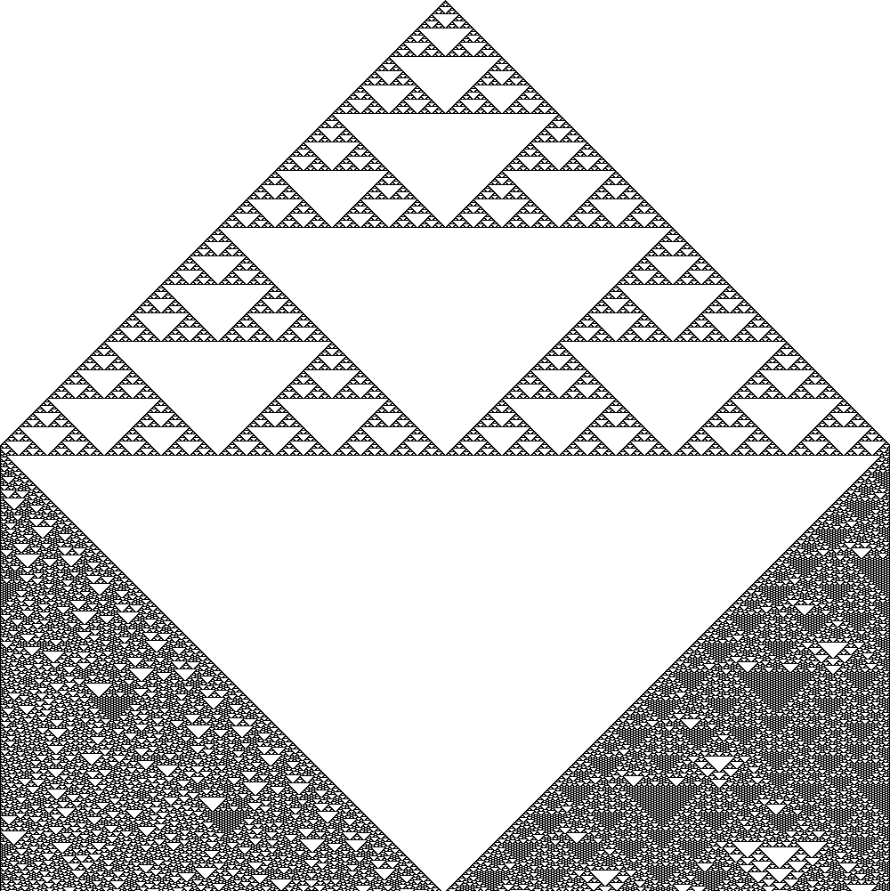

# elementary-automata

A simple program to generate images for Wolfram's [elementary automata](http://mathworld.wolfram.com/ElementaryCellularAutomaton.html). The output looks like this (for [rule 126](http://mathworld.wolfram.com/Rule126.html)):

## Usage

`elementary-automata [<flags>] <rule> <file>`

### Flags

| Flag    | What does it do?                                                   | Default |
| ------- | ------------------------------------------------------------------ | ------- |
| `-s`    | How large is each generation?                                      | 1000    |
| `-g`    | How many generations should be simulated?                          | 1000    |
| `scale` | How large should each cell appear in the output image (in pixels)? | 1       |

## Testing

You need [Ginkgo](https://github.com/onsi/ginkgo), [Gomega](https://github.com/onsi/gomega), and [Counterfeiter](https://github.com/maxbrunsfeld/counterfeiter) installed to run the tests.

1. `go get ./...`
1. `go generate ./...`
1. `go test ./...` _or_ `ginkgo -r`
